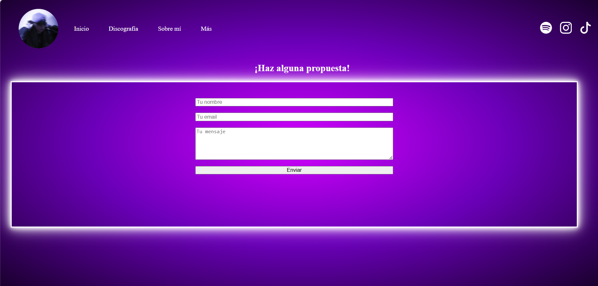
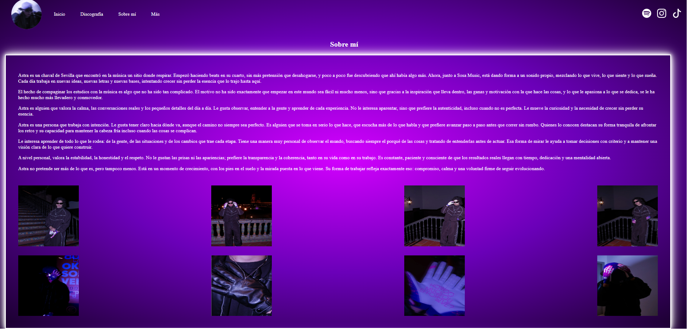

# MarioP-rezAcosta-PersonalProyects

LEE ESTE DOCUMENTO PARA ENTENDER.

El repositorio es privado ya que hay una existencia de código que no quiero que sea publicado ya que es un proyecto personal que hice para un compositor (beatmaker) para poder atraer aún más audiencia.

Dejo aquí algunas muestras de como han algunos de mis proyectos:

Aquí tenemos un cuestionario para analizar alguna propuesta de mejora o cualquier mensaje que nos envíen

    
  

Esto sería una sección donde se hablaría un poco sobre quién es él. Le bajo el zoom para que se vea completo

  

  

Todavía falta bastante desarrollo, ya que hay que tener en cuenta que no este beatmaker no lleva mucho tiempo trabajando en el mundo de la música, por lo tando habría que ir actualizando la web cada vez que lance alguna novedad. Hay otras dos secciones. Una de ellas es la discografía, que como he dicho antes, no tiene todavía publicadas muchas cosas. Después tenemos un inicio, donde están las novedades y demás.

